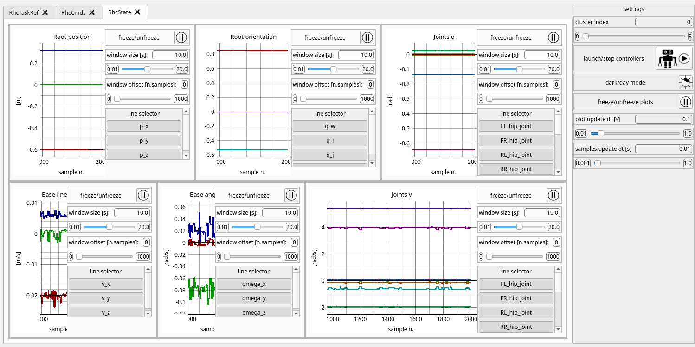

### AliengoExample package

|Isaac simulation|debugging GUI|   
|:----------------------------------------------------------------------------:|:----------------------------------------------------------------------------------------------------------------:|
|   | 
Example scripts and implementations using the following two packages:
 
- [ControlClusterUtils](https://github.com/AndPatr/ControlClusterUtils): utilities to create a CPU-based controllers cluster to be interfaced with GPU-based simulators 
- [OmniCustomGym](https://github.com/AndPatr/OmniCustomGym): custom implementations of Tasks and Gyms for for Omniverse Isaac Sim based on Gymnasium. Easy URDF and SRDF import/cloning and simulation configuration exploiting Omniverse API.

The preferred way of using AliengoExample package is to employ the provided [mamba](https://mamba.readthedocs.io/en/latest/user_guide/mamba.html) environment. 

Installation instructions:
- First install Mamba by running ```curl -L -O "https://github.com/conda-forge/miniforge/releases/latest/download/Mambaforge-$(uname)-$(uname -m).sh"``` and then ```bash Mambaforge-$(uname)-$(uname -m).sh```.

- Create the mamba environment by running ```create_mamba_env.sh```. This will properly setup a Python 3.7 mamba environment named ```AliengoExample``` with (almost) all necessary dependencies

- Activate the environment with ```mamba activate aliengo_example```

- From the root folder install the package with ```pip install --no-deps -e .```

- Download [Omniverse Launcer](https://www.nvidia.com/en-us/omniverse/download/), go to the "exchange" tab and install ``` Omniverse Cache``` and  ```Isaac Sim 2022.2.1```  (might take a while). You can then launch it from the Launcher GUI or by navigating to ```${HOME}/.local/share/ov/pkg/isaac_sim-2022.2.1``` and running the ```isaac-sim.sh``` script. When launching IsaacSim for the first time, compilation of ray tracing shaders will take place and may take a while. If the resources of the workstation/pc are limited (e.g. RAM < 16GB), the compilation may abort after a while. You can still manage to compile them by adding sufficient SWAP memory to the system. Before trying to recompile the shaders, remember however to first delete the cache at ```.cache/ov/Kit/*```.
 
- Clone and install [unitree_ros](https://github.com/AndrePatri/unitree_ros). Note: install in your workspace only the ```aliengo_description``` subpackage.

- Before running any script with dependencies on Omniverse packages, it's necessary to first source ```${HOME}/.local/share/ov/pkg/isaac_sim-*/setup_conda_env.sh``` (after having activated the environment).

External dependencies to be installed separately: 
- [Omniverse Isaac Sim](https://docs.omniverse.nvidia.com/app_isaacsim/app_isaacsim.html), photo-realistic GPU accelerated simulatorfrom NVIDIA.
- [unitree_ros](https://github.com/AndrePatri/unitree_ros). 


