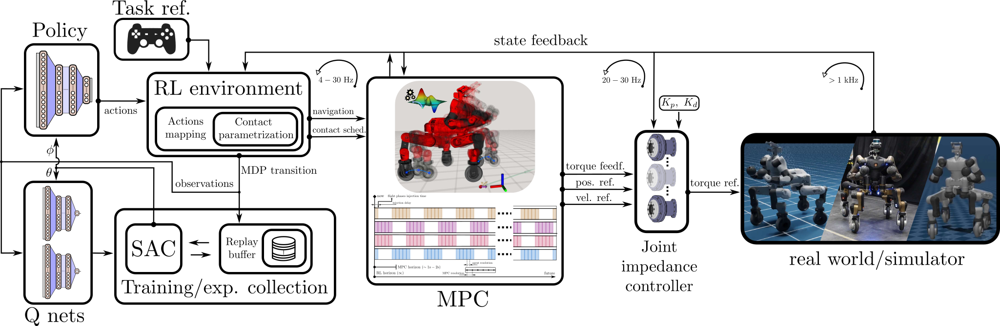
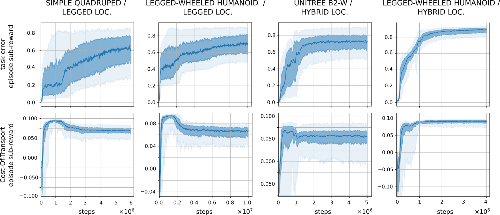
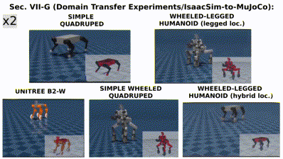
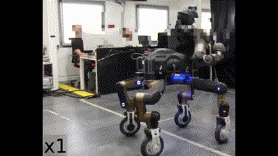
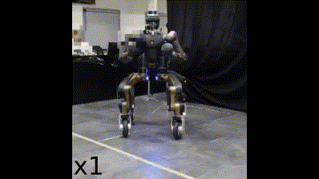
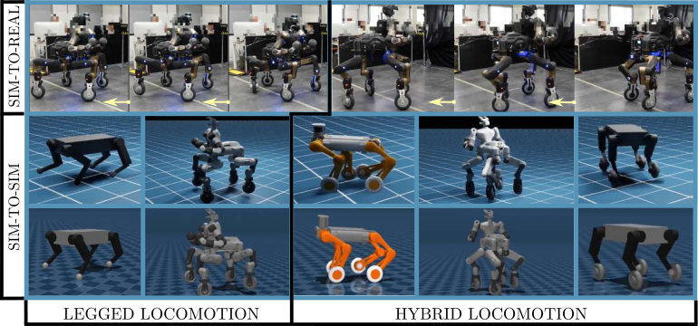
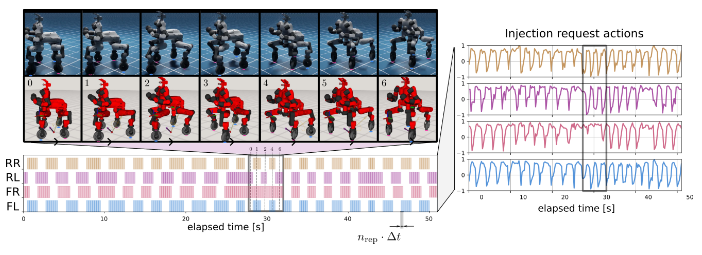
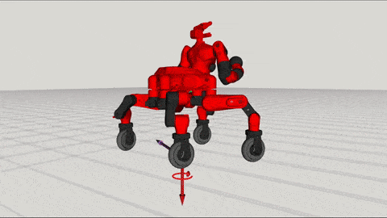
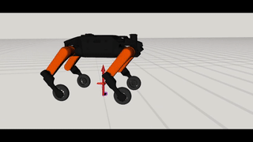
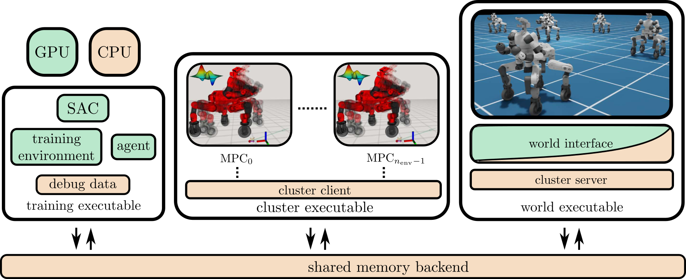

Reinforcement Learning-Augmented Model Predictive Control *at scale* for legged and hybrid robots. Part of the [IBRIDO](https://github.com/AndrePatri/IBRIDO) project.

## Architecture

<p align="center">
  
</p>

- **Hierarchical RL-MPC coupling** – The RL agent chooses contact schedules and twist commands for the underlying MPC controllers. A new flight phase is injected, for each limb, when the corresponding actions *instantaneously* exceed a given thresholds.

- **Sample-efficient learning at scale** – AugMPC achieves data-efficient training through **high-throughput experience generation**, enabled by aggressive MPC parallelization and fully vectorized simulation. On a workstation equipped with an **AMD Ryzen Threadripper 7970**, **128 GiB RAM**, and an **NVIDIA RTX 4090**, the system sustains **50+× real-time factor** while running **800 parallel environments / full rigid body MPC instances** at **20 Hz** with a **~1 s MPC horizon**, even with high dof robots like Centauro (nv=43). Training with **Soft Actor–Critic (SAC)** and MPCs in the loop typically converges in **1–10 × 10⁶ environment steps** (≈ **6 h wall-clock time**, corresponding to **9–29 simulated days**). This contrasts with **> 100 × 10⁶ steps** commonly required by blind end-to-end RL locomotion policies.

<p align="center">
  
</p>

- **Domain adaptability** – thanks to MPC's robustness, successful sim-to-sim and sim-to-real zero-shot transfer *without any domain randomization* (no contact properties, inertial, timing randomizations).
<p align="center">
  
</p>
<p align="center">
  
  
</p>

- **Robot adaptability** – validated on robots with *different morphologies and weight distributions* (30-120 Kg), with standard legged and *hybrid locomotion* tasks.

<p align="center">
  
</p>

- **Non-Gaited** contact scheduling – our architecture is able to generate completely acyclic gaits and timing adaptations:

<p align="center">
  
</p>
<p align="center">
      
  
</p>

- Easily extensible to **unstructured** environments

  Non-flat terrain example:
  <p align="center">
    
  </p>
  
  Enabled by
    - Raw heightmap in observation
    - Granted agent control of feet clearance, landing height and flight duration 


## Software
<p align="center">
  
</p>

**Shared-memory first design**: AugMPC relies on a shared memory layer, built on top of [EigenIPC](https://github.com/AndrePatri/EigenIPC) for deterministic, real-time-safe communication between simulators, controllers, and learning processes.

AugMPC’s is essentially made of three main components:

1. **World interface** – Implements `AugMPCWorldInterfaceBase`. It connects to Isaac Sim, xbot2, or hardware, publishes robot states, and triggers MPCHive controllers via shared memory. Optional remote stepping lets the training loop decide when the simulator should advance.
2. **MPC cluster** – Uses [MPCHive](https://github.com/AndrePatri/MPCViz)'s `ControlClusterServer/Client` to spawn multiple receding-horizon controllers (see `aug_mpc.controllers`). Each controller reads robot states, solves its MPC problem and writes predictions and commands back to shared memory.
3. **Training environment + RL algorithm** – An `AugMPCTrainingEnvBase` derivative defines the MDP at hand (observations, actions, rewards, terminations, trucations), which is then used by the training executable (SAC is the default, PPO supported).

Specific implentations of world interfaces and training environments are available at [AugMPCEnvs](https://github.com/AndrePatri/AugMPCEnvs).

## Repository layout

```
aug_mpc/
├── training_envs/     # Base classes and wrappers for AugMPCEnvs environments
├── world_interfaces/  # Base world interface that AugMPCEnvs extends
├── controllers/       # LRHC/MPCHive clients and Horizon-based MPC implementations
├── agents/            # Neural network policies (PPO, SAC, dummy)
├── training_algs/     # PPO/SAC trainers, rollout logic, persistence
├── scripts/           # Launchers for clusters, world interfaces, and training loops
└── utils/             # Shared-memory helpers, visualization bridges, teleop, math/utils
```

## Installation

The preferred way to install MPCHive is through [ibrido-containers](https://github.com/AndrePatri/ibrido-containers), which ships with all necessary dependencies.

## Public models and training runs
Public demo models are made available at [AugMPCModels](https://huggingface.co/AndrePatri/AugMPCModels). The associated runs associated can be found [here](https://wandb.ai/andrepatriteam/AugMPCModels?nw=nwuserandrepatri).

## Citing our work

If you use AugMPC in your research, please cite:

```bibtex
@misc{patrizi2026rlaugmentedmpcnongaitedlegged,
  author={Patrizi, Andrea and Rizzardo, Carlo and Laurenzi, Arturo and Ruscelli, Francesco and Rossini, Luca and Tsagarakis, Nikos G.},
  journal={IEEE Robotics and Automation Letters}, 
  title={RL-Augmented MPC for Non-Gaited Legged and Hybrid Locomotion}, 
  year={2026},
  volume={},
  number={},
  pages={1-8},
  doi={10.1109/LRA.2026.3675839},
}
```

Paper video available [here](https://www.youtube.com/watch?v=I08UywVVhN4).

Preprint [here](https://arxiv.org/abs/2603.10878)

## Extending AugMPC (TBD)

1. **New controller** – 
2. **New world interface** – 
3. **New training environment** – 
4. **New agent/algorithm** – 
